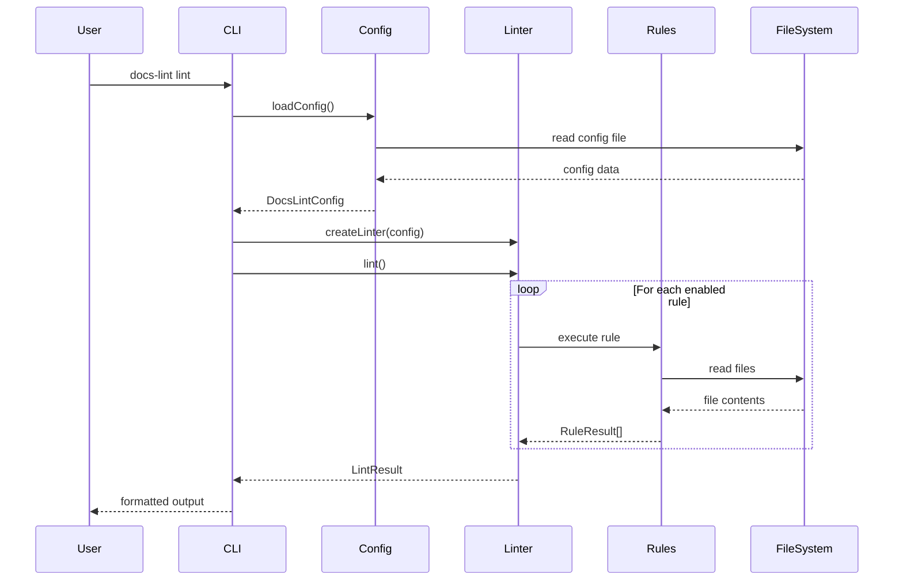

# アーキテクチャ設計

**バージョン**: 1.18.0
**更新日**: 2026-02-18

---

## 概要

docs-lint のシステムアーキテクチャを定義します。

## 技術選定

| 項目 | 選定 | 理由 |
|------|------|------|
| 言語 | TypeScript | 型安全性、IDE補完、G.U.Corp標準 |
| ランタイム | Node.js 18+ | LTS、ESM対応 |
| モジュール形式 | ESM | 将来標準、Tree-shaking対応 |
| CLIフレームワーク | Commander.js | 軽量、広く採用 |
| ファイルグロブ | glob | 標準的、高機能 |
| 出力装飾 | chalk | ターミナルカラー |

## システム構成

```text
┌─────────────────────────────────────────────────────────────┐
│                         CLI Layer                           │
│  ┌─────────┐ ┌──────┐ ┌───────────────┐ ┌───────────────┐  │
│  │  lint   │ │ init │ │ init-standards│ │ check-structure│ │
│  └────┬────┘ └──┬───┘ └───────┬───────┘ └───────┬───────┘  │
└───────┼─────────┼─────────────┼─────────────────┼──────────┘
        │         │             │                 │
┌───────▼─────────▼─────────────▼─────────────────▼──────────┐
│                       Core Layer                            │
│  ┌─────────────────┐  ┌────────────────┐  ┌─────────────┐  │
│  │     Linter      │  │  ConfigLoader  │  │  Templates  │  │
│  │  (main engine)  │  │                │  │             │  │
│  └────────┬────────┘  └────────────────┘  └─────────────┘  │
└───────────┼────────────────────────────────────────────────┘
            │
┌───────────▼────────────────────────────────────────────────┐
│                       Rules Layer                           │
│  ┌──────────┐ ┌──────────┐ ┌───────────┐ ┌──────────────┐  │
│  │ content  │ │structure │ │terminology│ │requirements  │  │
│  │  rules   │ │  rules   │ │   rules   │ │   rules      │  │
│  └──────────┘ └──────────┘ └───────────┘ └──────────────┘  │
└────────────────────────────────────────────────────────────┘
```

## コンポーネント詳細

### CLI Layer

| コンポーネント | 責務 | ファイル |
|---------------|------|----------|
| lint | リントの実行、結果表示 | src/cli.ts |
| init | 設定ファイルの対話的生成 | src/cli.ts |
| init-standards | DOCUMENT_STANDARDS.md生成 | src/cli.ts |
| check-structure | フォルダ構成チェック | src/cli.ts |
| scaffold | 標準フォルダ構成生成 | src/cli.ts |
| `review:spec` | AIレビュー実行 | src/cli.ts |

### Core Layer

| コンポーネント | 責務 | ファイル |
|---------------|------|----------|
| Linter | ルールの実行、結果集約 | src/linter.ts |
| ConfigLoader | 設定ファイルの読み込み・マージ | src/cli/config.ts |
| Templates | 標準テンプレートの提供 | src/templates/standards.ts |
| AIPrompt | AI向けプロンプト生成 | src/ai-prompt.ts |

### Rules Layer

| コンポーネント | 責務 | ファイル |
|---------------|------|----------|
| content rules | コンテンツ品質チェック | src/rules/content.ts |
| structure rules | フォルダ構成チェック | src/rules/structure.ts |
| terminology rules | 用語統一チェック | src/rules/terminology.ts |

## データフロー



## ディレクトリ構成

```text
src/
├── cli.ts                 # CLIエントリーポイント
├── linter.ts              # メインリンターエンジン
├── types.ts               # TypeScript型定義
├── ai-prompt.ts           # AI向けプロンプト生成
├── index.ts               # パブリックAPI
├── cli/
│   └── config.ts          # 設定ローダー
├── rules/
│   ├── content.ts         # コンテンツルール
│   ├── structure.ts       # 構造ルール
│   └── terminology.ts     # 用語ルール
└── templates/
    ├── standards.ts       # 標準テンプレート
    └── translations/      # 多言語対応
        ├── ja/
        └── en/
```

## 拡張ポイント

### カスタムルールの追加

1. `src/rules/` に新しいルールファイルを作成
2. `RuleResult` 型に準拠した関数をエクスポート
3. `src/linter.ts` でルールを登録

### 新しい出力フォーマットの追加

1. `src/formatters/` ディレクトリを作成
2. フォーマッター関数を実装
3. CLIに `--format` オプションを追加

---

## 関連ドキュメント

- [要件定義](../01-requirements/README.md)
- [クラス設計](./CLASS.md)
- [エラー処理設計](./ERROR-HANDLING.md)
- [API仕様](./API.md)
