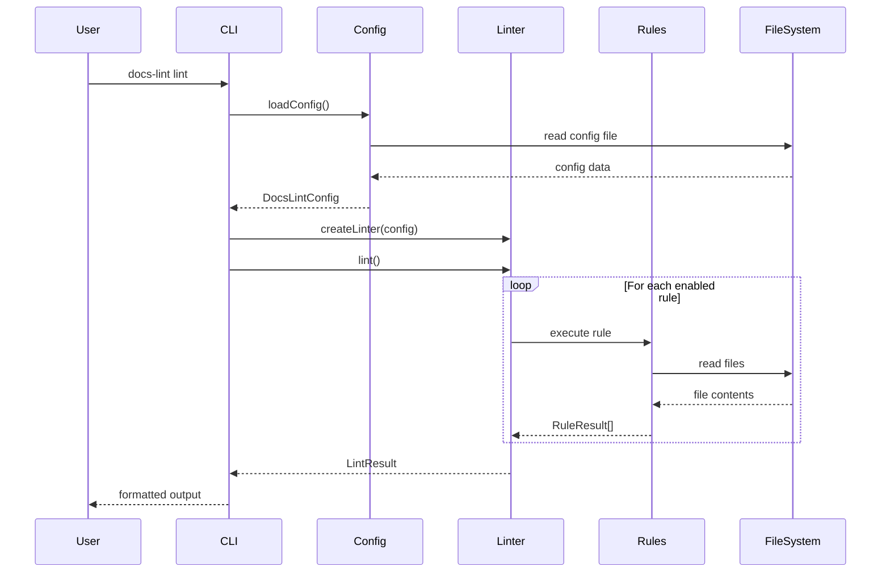

# アーキテクチャ設計

**バージョン**: 2.0.0
**更新日**: 2026-02-18

---

## 概要

docs-lint のシステムアーキテクチャを定義します。

## 技術選定

| 項目 | 選定 | 理由 |
|------|------|------|
| 言語 | TypeScript | 型安全性、IDE補完、G.U.Corp標準 |
| ランタイム | Node.js 18+ | LTS、ESM対応 |
| モジュール形式 | ESM | 将来標準、Tree-shaking対応 |
| CLIフレームワーク | Commander.js | 軽量、広く採用 |
| ファイルグロブ | glob | 標準的、高機能 |
| 出力装飾 | chalk | ターミナルカラー |

## システム構成

```text
┌──────────────────────────────────────────────────────────────────────────┐
│                              CLI Layer (v2.0)                            │
│  ┌──────────┐ ┌──────────┐ ┌─────────────┐ ┌─────────────┐ ┌──────────┐ │
│  │   lint   │ │   init   │ │    check    │ │   review    │ │   show   │ │
│  │          │ │--standards│ │  code/spec  │ │  code/spec  │ │standards │ │
│  │  --fix   │ │--scaffold │ │             │ │  (MECE)     │ │config    │ │
│  └────┬─────┘ └────┬─────┘ └──────┬──────┘ └──────┬──────┘ │rules     │ │
│       │            │              │               │        └────┬─────┘ │
└───────┼────────────┼──────────────┼───────────────┼─────────────┼───────┘
        │            │              │               │             │
┌───────▼────────────▼──────────────▼───────────────▼─────────────▼───────┐
│                            Core Layer                                    │
│  ┌─────────────────┐  ┌────────────────┐  ┌─────────────┐  ┌──────────┐ │
│  │     Linter      │  │  ConfigLoader  │  │  Templates  │  │ AIPrompt │ │
│  │  (main engine)  │  │                │  │             │  │  (MECE)  │ │
│  └────────┬────────┘  └────────────────┘  └─────────────┘  └──────────┘ │
└───────────┼─────────────────────────────────────────────────────────────┘
            │
┌───────────▼─────────────────────────────────────────────────────────────┐
│                            Rules Layer                                   │
│  ┌──────────┐ ┌──────────┐ ┌───────────┐ ┌──────────────┐ ┌───────────┐│
│  │ content  │ │structure │ │terminology│ │requirements  │ │ markdown  ││
│  │  rules   │ │  rules   │ │   rules   │ │   rules      │ │   lint    ││
│  └──────────┘ └──────────┘ └───────────┘ └──────────────┘ └───────────┘│
└─────────────────────────────────────────────────────────────────────────┘
```

## コンポーネント詳細

### CLI Layer

| コンポーネント | 責務 | ファイル |
|---------------|------|----------|
| lint | リントの実行、結果表示、`--fix`で自動修正 | src/cli.ts |
| init | 設定ファイル生成（`--standards`, `--scaffold`オプション） | src/cli.ts |
| check code | コードチェック（テストファイル存在、カバレッジ） | src/cli.ts |
| check spec | 仕様書チェック（構造、参照） | src/cli.ts |
| review code | AIコードレビュー（要件カバレッジ分析） | src/cli.ts |
| review spec | AI仕様書レビュー（MECEチェック含む） | src/cli.ts |
| show standards | ドキュメント標準の表示 | src/cli.ts |
| show config | 現在の設定表示 | src/cli.ts |
| show rules | 利用可能なルール一覧表示 | src/cli.ts |

### Core Layer

| コンポーネント | 責務 | ファイル |
|---------------|------|----------|
| Linter | ルールの実行、結果集約 | src/linter.ts |
| ConfigLoader | 設定ファイルの読み込み・マージ | src/cli/config.ts |
| Templates | 標準テンプレートの提供 | src/templates/standards.ts |
| AIPrompt | AI向けプロンプト生成 | src/ai-prompt.ts |

### Rules Layer

| コンポーネント | 責務 | ファイル |
|---------------|------|----------|
| content rules | コンテンツ品質チェック | src/rules/content.ts |
| structure rules | フォルダ構成チェック | src/rules/structure.ts |
| terminology rules | 用語統一チェック | src/rules/terminology.ts |

## データフロー



## ディレクトリ構成

```text
src/
├── cli.ts                 # CLIエントリーポイント（v2.0コマンド構造）
├── linter.ts              # メインリンターエンジン
├── types.ts               # TypeScript型定義
├── index.ts               # パブリックAPI
├── ai/
│   ├── review-prompt.ts   # AI向けレビュープロンプト生成（MECE含む）
│   └── ...                # その他AIプロンプト関連
├── cli/
│   └── config.ts          # 設定ローダー
├── code/
│   └── ...                # コードチェック関連
├── rules/
│   ├── content.ts         # コンテンツルール
│   └── structure.ts       # 構造ルール
└── templates/
    ├── standards.ts       # 標準テンプレート
    └── translations/      # 多言語対応
        ├── ja/
        └── en/
```

## 拡張ポイント

### カスタムルールの追加

1. `src/rules/` に新しいルールファイルを作成
2. `RuleResult` 型に準拠した関数をエクスポート
3. `src/linter.ts` でルールを登録

### 新しい出力フォーマットの追加

1. `src/formatters/` ディレクトリを作成
2. フォーマッター関数を実装
3. CLIに `--format` オプションを追加

---

## 関連ドキュメント

- [要件定義](../01-requirements/README.md)
- [クラス設計](./CLASS.md)
- [エラー処理設計](./ERROR-HANDLING.md)
- [API仕様](./API.md)
