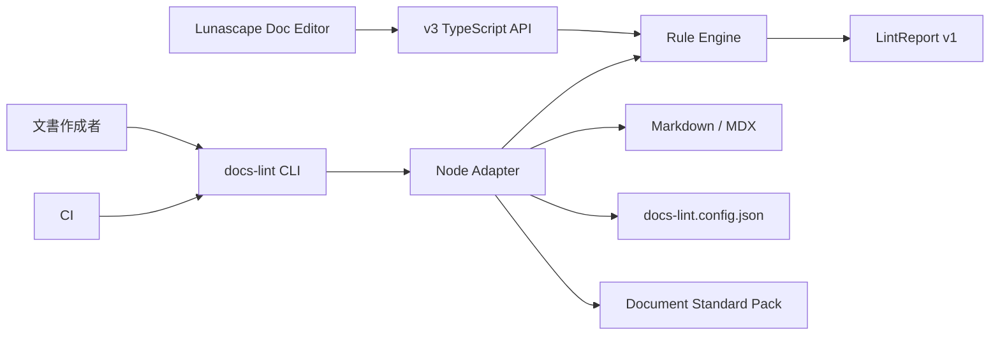
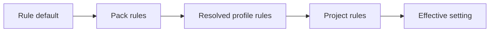

# docs-lint v3 アーキテクチャ設計書

## システムコンテキスト


```mermaid
flowchart LR
  Author[文書作成者] --> CLI[docs-lint CLI]
  CI[CI] --> CLI
  Editor[Lunascape Doc Editor] --> API[v3 TypeScript API]
  CLI --> Node[Node Adapter]
  API --> Engine[Rule Engine]
  Node --> Engine
  Node --> Docs[Markdown / MDX]
  Node --> Config[docs-lint.config.json]
  Node --> Pack[Document Standard Pack]
  Engine --> Report[LintReport v1]
```

## 設計方針

| ID | 決定 | 理由 |
| --- | --- | --- |
| ADR-001 | v2 互換層を v3 実行経路に置かない | 暗黙変換と分岐の増殖を止めるため |
| ADR-002 | rule engine を registry 方式にする | ルール追加時に巨大な条件分岐を変更しないため |
| ADR-003 | filesystem を Node adapter に隔離する | core を Editor、CLI、将来の browser worker から再利用するため |
| ADR-004 | 組織規約を Standard Pack とする | G.U. 固有構造を汎用コアから分離するため |
| ADR-005 | Pack は JSON/Markdown のみとする | 配布 Pack に任意コード実行権限を与えないため |
| ADR-006 | AI provider をコア依存にしない | 機密文書の外部送信境界と provider 選択を明示するため |
| ADR-007 | 設定と report を schema version で識別する | Editor、CI、CLI の段階的更新を安全にするため |

## 構成要素

```text
src/
├── core/
│   ├── engine.ts          # rule registry、優先順位、診断集約
│   ├── config.ts          # 純粋な既定値・正規化
│   ├── types.ts           # public contracts
│   └── rules/             # 副作用を持たない built-in rules
├── standards/
│   ├── types.ts           # Standard Pack contracts
│   └── manifest.ts        # manifest validation/profile resolution
├── node/
│   ├── config.ts          # config discovery、Editor config bridge
│   ├── workspace.ts       # glob、front matter、safe write
│   ├── standard-pack.ts   # Pack I/O、safe template rendering
│   └── run.ts             # Node adapter composition root
└── cli/
    ├── program.ts         # command registration
    └── commands/          # lint/init/migrate/create/pack
```

依存方向は `CLI → Node adapter → Core/Standards` とする。Core は CLI、Commander、filesystem、外部 AI SDK を import しない。

## データ設計

### 設定優先順位


```mermaid
flowchart LR
  Rule[Rule default] --> Pack[Pack rules]
  Pack --> Profile[Resolved profile rules]
  Profile --> Project[Project rules]
  Project --> Effective[Effective setting]
```

より右側を優先する。`standard` は `docs-lint.config.json` を優先し、未指定の場合だけ文書ルートの `lunascape-docs.json.documentStandards` を読む。

### 診断契約

`LintReport.schemaVersion` は診断 JSON 自体の互換性を表す。各診断には rule ID、severity、message を必須とし、file、line/column、fix、data は必要な場合だけ付与する。ルールの例外は `Rule failed:` 診断へ変換する。

### Standard Pack

Pack は `pack.json` と Markdown template からなる。profile は複数 profile を継承できる。継承は宣言順に親をマージし、最後に子を適用する。配列は順序を維持して重複を除去する。

## セキュリティ設計

- project 文書 path と Pack template path は root からの相対パスとして解決する。
- `..`、absolute path、root 外 symlink を拒否する。
- `{{variable}}` の置換だけを許し、式や JavaScript を評価しない。
- 文書作成は exclusive create を既定とし、上書きは明示的な `--force` に限定する。
- v3 コアは network API を呼ばず、秘密情報を要求しない。

## 運用設計

- CI は `npm run check`、`npm test`、`npm run build`、`npm audit --omit=dev` を実行する。
- Pack と docs-lint package は独立して version を持つ。
- breaking change は config schema または report schema の version 更新として扱う。
- v2 は Git tag と履歴で保全し、v3 の作業ツリー、build、test、package files に互換コードを置かない。
