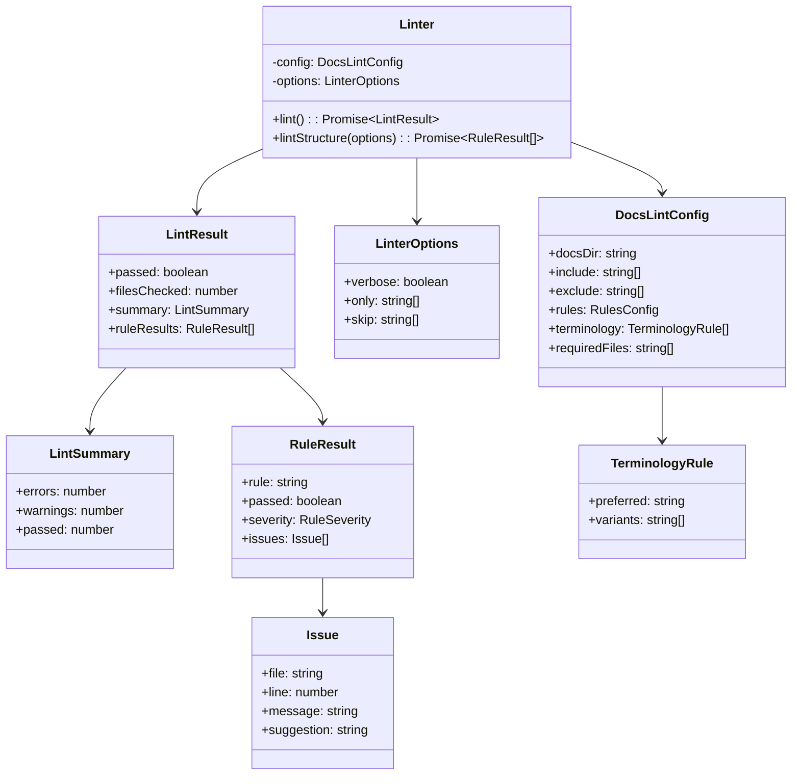

# クラス設計

**バージョン**: 2.0.0
**更新日**: 2026-02-18

---

## 概要

docs-lint の主要クラスとインターフェースを定義します。

## クラス図



## 型定義

### DocsLintConfig

```typescript
interface DocsLintConfig {
  docsDir: string;
  include: string[];
  exclude: string[];
  rules: {
    brokenLinks: RuleSeverity;
    legacyFileNames: RuleSeverity;
    versionInfo: RuleSeverity;
    relatedDocuments: RuleSeverity;
    headingHierarchy: RuleSeverity;
    todoComments: RuleSeverity;
    codeBlockLanguage: RuleSeverity;
    orphanDocuments: RuleSeverity;
    terminology: RuleSeverity;
    bidirectionalRefs: RuleSeverity;
    requirementsCoverage: RuleSeverity;
    standardFolderStructure: RuleSeverity;
    folderNumbering: FolderNumberingConfig;
    fileNaming: RuleSeverity;
    standardFileNames: RuleSeverity;
    requirementTestMapping: RuleSeverity;
    standardsDrift: RuleSeverity;
  };
  terminology: TerminologyRule[];
  requiredFiles: string[];
  requirementPatterns: string[];
}

type RuleSeverity = 'off' | 'warn' | 'error';
```

### FolderNumberingConfig

```typescript
interface FolderNumberingConfig {
  severity: RuleSeverity;
  strictPaths: string[];  // 番号必須のパス
  checkSequence: boolean; // 連番チェック
}
```

### LinterOptions

```typescript
interface LinterOptions {
  verbose?: boolean;
  only?: string[];
  skip?: string[];
}
```

### LintResult

```typescript
interface LintResult {
  passed: boolean;
  filesChecked: number;
  summary: {
    errors: number;
    warnings: number;
    passed: number;
  };
  ruleResults: RuleResult[];
}
```

### RuleResult

```typescript
interface RuleResult {
  rule: string;
  passed: boolean;
  severity: RuleSeverity;
  issues: Issue[];
}
```

### Issue

```typescript
interface Issue {
  file: string;
  line?: number;
  message: string;
  suggestion?: string;
}
```

### FolderDefinition

```typescript
interface FolderDefinition {
  path: string;
  required: boolean;
  description: string;
  files?: string[];         // 必須ファイル
  optionalFiles?: string[]; // 推奨ファイル
}
```

## ルール関数シグネチャ

各ルールは以下のシグネチャに従います：

```typescript
type RuleFunction = (
  docsDir: string,
  files: string[],
  config: DocsLintConfig
) => Promise<Issue[]>;
```

### コンテンツルール

```typescript
// src/rules/content.ts
export function checkBrokenLinks(docsDir: string, files: string[]): Promise<Issue[]>;
export function checkLegacyFileNames(docsDir: string, files: string[]): Promise<Issue[]>;
export function checkVersionInfo(docsDir: string, files: string[]): Promise<Issue[]>;
export function checkRelatedDocuments(docsDir: string, files: string[]): Promise<Issue[]>;
export function checkHeadingHierarchy(docsDir: string, files: string[]): Promise<Issue[]>;
export function checkTodoComments(docsDir: string, files: string[]): Promise<Issue[]>;
export function checkCodeBlockLanguage(docsDir: string, files: string[]): Promise<Issue[]>;
export function checkOrphanDocuments(docsDir: string, files: string[]): Promise<Issue[]>;
```

### 構造ルール

```typescript
// src/rules/structure.ts
export function checkStandardFolderStructure(docsDir: string): Promise<Issue[]>;
export function checkFolderNumbering(docsDir: string, config: FolderNumberingConfig): Promise<Issue[]>;
export function checkFileNaming(docsDir: string, files: string[]): Promise<Issue[]>;
export function checkStandardFileNames(docsDir: string): Promise<Issue[]>;
export function checkRequirementTestMapping(docsDir: string, files: string[]): Promise<Issue[]>;
```

### 用語ルール

```typescript
// src/rules/terminology.ts
export function checkTerminology(
  docsDir: string,
  files: string[],
  terminology: TerminologyRule[]
): Promise<Issue[]>;
```

## デフォルト設定

```typescript
export const DEFAULT_CONFIG: DocsLintConfig = {
  docsDir: './docs',
  include: ['**/*.md'],
  exclude: ['node_modules/**', '**/drafts/**'],
  rules: {
    brokenLinks: 'error',
    legacyFileNames: 'error',
    versionInfo: 'warn',
    relatedDocuments: 'warn',
    headingHierarchy: 'warn',
    todoComments: 'warn',
    codeBlockLanguage: 'warn',
    orphanDocuments: 'warn',
    terminology: 'warn',
    bidirectionalRefs: 'off',
    requirementsCoverage: 'warn',
    standardFolderStructure: 'error',
    folderNumbering: {
      severity: 'warn',
      strictPaths: ['', '02-spec'],
      checkSequence: true,
    },
    fileNaming: 'warn',
    standardFileNames: 'warn',
    requirementTestMapping: 'warn',
    standardsDrift: 'warn',
  },
  terminology: [],
  requiredFiles: ['README.md'],
  requirementPatterns: ['FR-([A-Z]+-)*\\d{3}'],
};
```

---

## 関連ドキュメント

- [アーキテクチャ設計](./ARCHITECTURE.md)
- [UML設計図](./UML.md)
- [API仕様](./API.md)
- [要件定義](../01-requirements/README.md)
