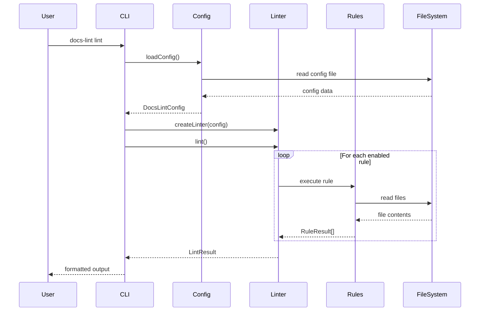
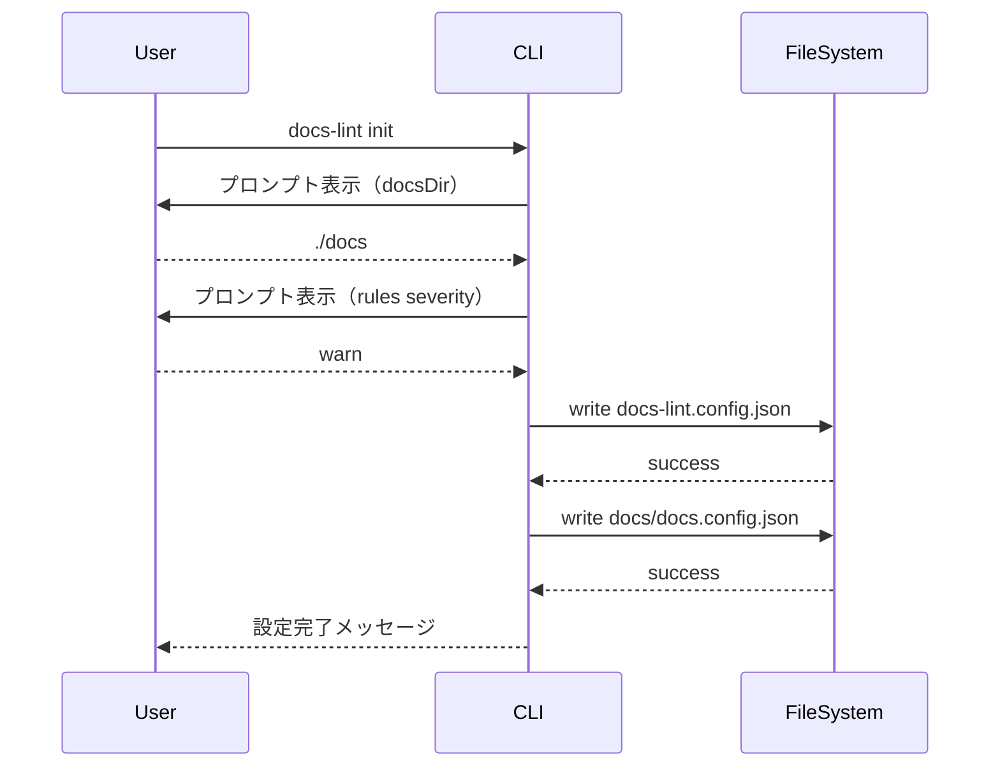
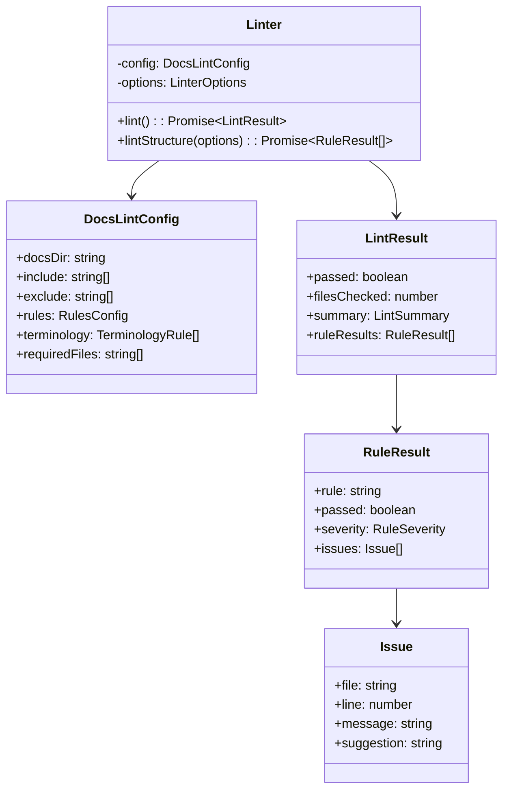
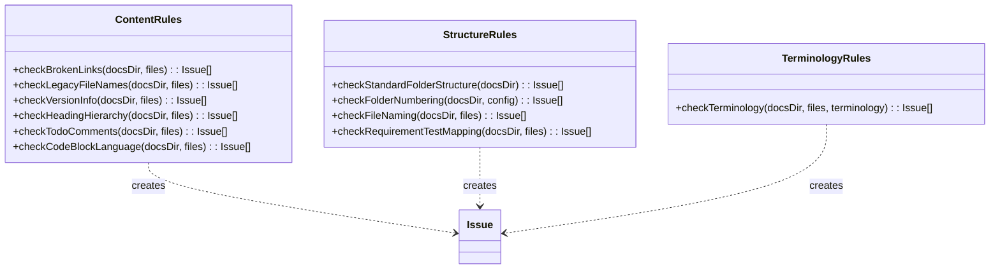
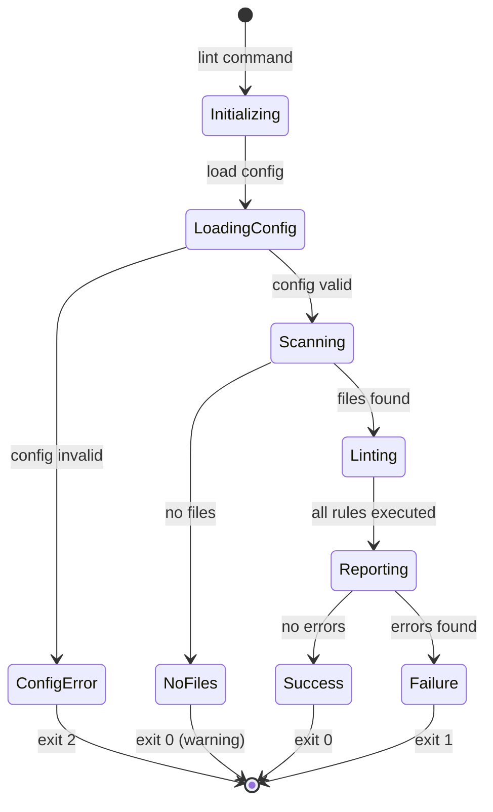
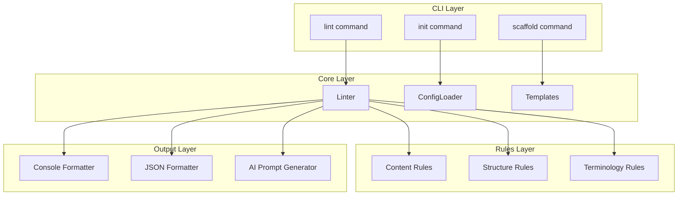

# UML設計図

**バージョン**: 1.0
**更新日**: 2025-12-10

---

## 概要

docs-lint の主要なUML図を記載します。

## シーケンス図

### lint コマンド実行フロー

### init コマンド実行フロー

## クラス図

### コアクラス

### ルールクラス

## 状態遷移図

### リント実行状態

## コンポーネント図

---

## 関連ドキュメント

- [アーキテクチャ設計](./ARCHITECTURE.md)
- [クラス設計](./CLASS.md)
- [API仕様](./API.md)
